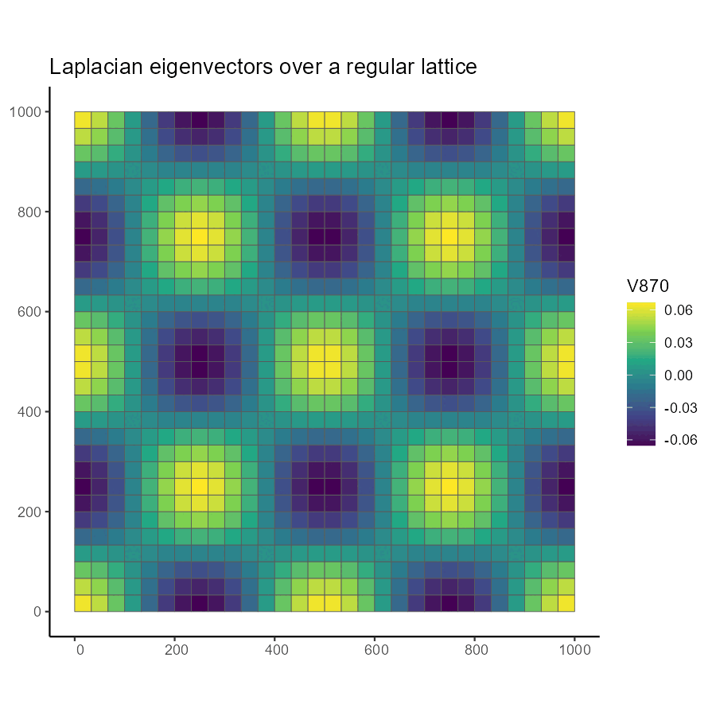
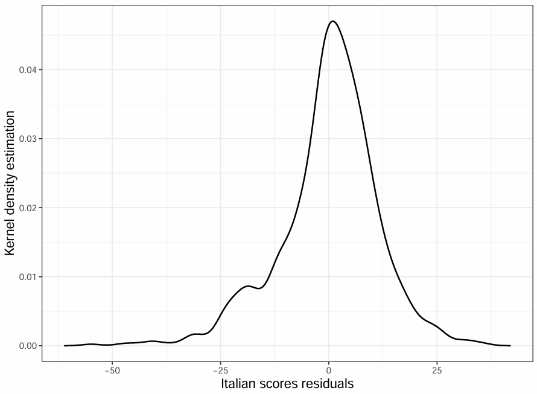
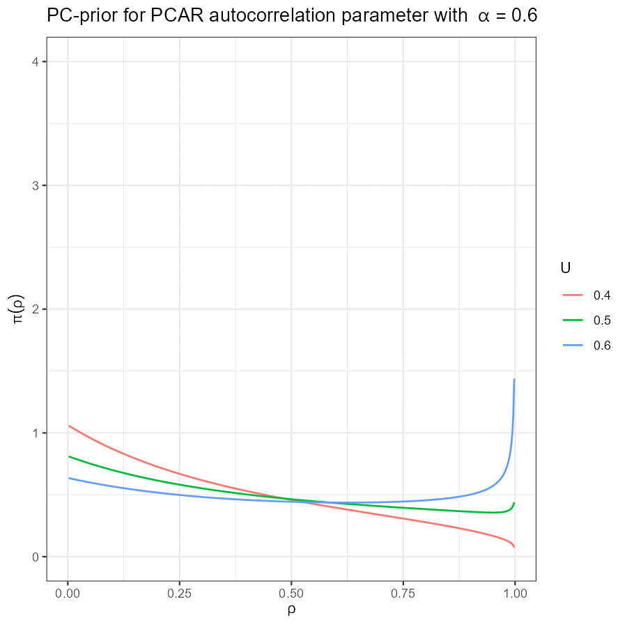
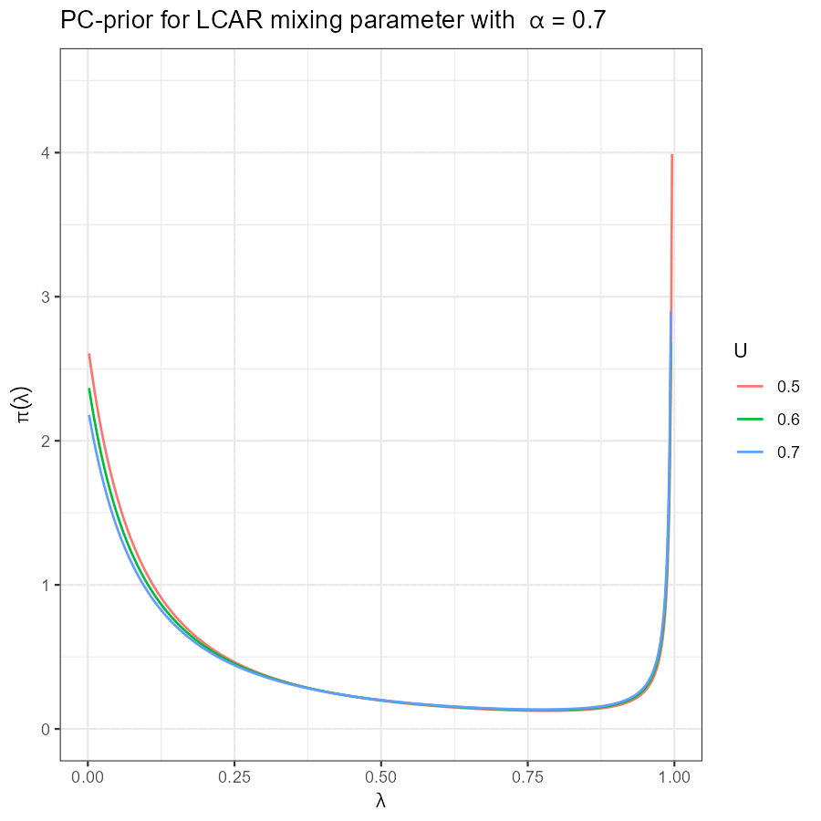

## Motivation: territorial disparities and policy relevance

  - Italy exhibits persistent **territorial divides** in infrastructure, services, and outcomes
  
  - PNRR / NextGenerationEU and GRINS: demand for granular, data-informed **territorial** planning
  
  - Research quest: quantify **local** disparities through interpretable models
  
  - Method of analysis: parametric and uncertainty-informed statistical modelling
  $\Rightarrow$ **areal data** = **administrative domain** for policies
  
```{r setup, include=FALSE}
knitr::opts_chunk$set(echo = FALSE, warning= FALSE, message = FALSE)
par(mar = c(2,2,1,1))
library(magrittr)
library(sf)
library(INLA)

for (file in list.files("Data", full.names = T)) load(file)

```


## Methodological framework

  - **Areal modelling**: spatial domain described by adjacency graphs $\Rightarrow$ **Conditional autoregressive (CAR)** [@CAR] models
  
  - **Bayesian** inference for interpretable uncertainty, flexible prior setup and model comparison
  $\Rightarrow$ Computation: **Integrated Nested Laplace Approximation** [@INLA], [@VBINLA2024] 
  
  - Recurring issues:
    - **hyperprior interpretability** $\Rightarrow$ **Penalised complexity priors** [@PC]
    - **Spatial confounding** $\Rightarrow$ *Spatial+2.0* filtering [@Urdangarin24]
    


## Chapter 2: The SchoolDataIT `R` package

  - Policy and research need: **georeferenced open data** regarding **school infrastructure** and **student outcomes**
  
  - Available data come from **multiple providers** in heterogeneous formats $\Rightarrow$ need for **harmonisation**
  
  - **Contribution**: an R package that retrieves, cleans, harmonises, and maps data at LAU / NUTS-3 level
  
  - Package available 
    - on **CRAN**, under version [0.2.12](https://CRAN.R-project.org/package=SchoolDataIT)
    - on **GitHub** under **experimental** version [0.2.13](https://github.com/lcef97/SchoolDataIT)

  - **Open**-source [research paper](https://link.springer.com/article/10.1007/s10260-025-00805-0)


## Chapter 2: School data providers

  - **Ministry of Education**: 
    - National school **registry** 
    - **School buildings DB** $\Rightarrow$ school **infrastructure**
    - Counts of **students per class** $\Rightarrow$ classroom size
    - Average **teachers per class** (only at **province** level)
  
  - **INVALSI**: census survey indicators $\Rightarrow$ spatially homogeneous indicator of **student outcomes**
  
  - **ISTAT**: inner areas taxonomy $\Rightarrow$ synthetic indicator of municipality **infrastructural** state
  
  - **Infratel/MIMIT**: ultra-broadband activation status
  


## Chapter 2: Scraping data from the web

  - **Static scraping**: find provider links $\Rightarrow$ download $\Rightarrow$ parse into `R`

  - **Real-time** data retrieval and **no storage space** consumed on the **user local** machine
  
  - **CRAN quality policy**: R packages must *fail gracefully*
    
    - connection issues, invalid URLs, corrupted files $\Rightarrow$ clean **abort** mechanism: `R` functions return `NULL`, avoiding **crashes** (`ERROR` output)
  
  - **Emergency** fixes: instant repair on the GitHub experimental version (just contact the maintainer, i.e., me)


    

## Chapter 2: Package workflow
```{r flowchart, echo = F}
package.scheme <- function(width = 920) {
  return(DiagrammeR::grViz("digraph {
    graph [layout = dot, splines = ortho, rankdir = TB, nodesep = 1.5, overlap = false ]

    node [shape = parallelogram, style = filled, fillcolor = \"#D0DFF4\", fontcolor = black , color = \"#253A6B\", fontsize = 22 ]
    zero[label = 'User request']
    end1[label = 'Merged database']
    end2[label = 'Maps']

    node [shape = rectangle, style = filled, fillcolor = \"#D0DFF4\", fontcolor = black, color = \"#253A6B\", fontsize = 22, width = 3.4]
    F1[label = '`Get_` functions']
    F2[label = '`Util_` functions']
    F3[label = 'Group_ functions']
    F4[label = 'Set_DB']
    F5[label = 'Map_ functions']

    node [shape = oval, style = filled, fillcolor = \"#D0DFF4\", fontcolor = black,   color = \"#253A6B\", fontsize = 22, width = 3.4]
    O1[label = 'Raw datasets']
    O2[label = 'Spatial\ngeometries']
    O3[label = 'Edited datasets']
    O4[label = 'Aggregated datasets']

    # Invisible helper nodes for spacing
    node [shape = point, width = 0, height = 0, label = '']
    spacer2
    spacer1

    # Align nodes into ranks
    {rank = same; F1; O1}
    {rank = same; spacer1; F2}
    {rank = same; F3; spacer2; O4}
    {rank = same; F4; end1}

    # Edges and directions
    zero -> F1 [dir = forward]
    F1 -> O1  
    F1 -> O2  
    O1 -> spacer1 [dir = none]   
    spacer1 -> F2
    O1 -> F4 [style = dashed]
    O2 -> F5 [dir = forward]
    F2 -> O3  
    #F2 -> spacer2 [style = invisible]   
    F2 -> O4 
    O3 -> F3 [direction = forward]
    F3 -> O4 [dir = forward]
    O4 -> F4 [dir = forward]
    O4 -> F5 [dir = forward, style = dashed]
    F4 -> end1 [dir = forward]
    end1 -> F5 [dir = forward]
    F5 -> end2 [dir = forward]

  }", width = width))
}

package.scheme()
```


## Chapter 2: School buildings DB (ex.)

Example of infrastructural variable: availability of public transport in 2024/25 at the province level 
```{r transport map prov, echo = FALSE, message = FALSE, warning = FALSE, output = FALSE, fig.height = 3.6 }
library(SchoolDataIT)
Map_School_Buildings(data=DB25_MIUR_prov,
                     field="Urban_public_transport",
                     input_shp=Prov24_shp,level="NUTS-3",
                     order="High",plot="mapview",
                     InnerAreas=FALSE, verbose = FALSE)

```


## Chapter 2: School buildings DB (ex.)

Same variable, but at the finer level of municipalities (in the Apulia region in this case)

```{r transport map mun, echo = FALSE, message = FALSE, warning = FALSE, output = FALSE, fig.height = 3.6 }
library(SchoolDataIT)
Map_School_Buildings(data=DB25_MIUR_mun,
                     field="Urban_public_transport",
                     input_shp=Mun24_shp,level="LAU",
                     order="High",region_code=16,
                     plot="mapview",InnerAreas=FALSE, verbose = FALSE)

```


## Chapter 2: SchoolDataIT main achievements

  - Package output enabling both **descriptive** and **inferential** analysis
  
  - Observational length growing with time $\Rightarrow$ potential for panel analysis
  
  - In general, we can observe how **education disparities** aligns with more **general territorial vulnerability patterns** $\Rightarrow$ let us see it more in detail in the next chapter

  - Main **upstream** contribution: data access + harmonisation + reproducibility
  


## Chapter 3: Spatial modelling of INVALSI data

  - Modelling **municipality**-averaged **INVALSI** scores in **Italian and Mathematics** at the second year of high school in **2022/23** and assessing the association with candidate infrastructural **indicators** 

<!-- of the infrastructural state of municipalities -->
  
  - **Spatial autocorrelation** in observed scores $\Rightarrow$ **Intrinsic CAR** [@ICAR] latent model
  
  - **Sparse spatial structure** of INVALSI scores (most municipalities do not host a high school) $\Rightarrow$ spatial effects at the **province** level (finer level $\Rightarrow$ overparametrised)
  
  - **Open**-source [research paper](https://link.springer.com/article/10.1007/s10479-025-06842-y)
  


## Chapter 3: INVALSI scores (Maths)

Scores in Mathematics (2nd grade of high school, 2022/23)


```{r Invalsi MAT, echo = FALSE, message = FALSE, warning = FALSE, fig.height = 4.1}
pal <- viridisLite::viridis(12, option = "G", begin = 0.15, end = 1)

toplot_MAT <- Invalsi_A_MAT %>% 
  dplyr::select(.data$COD_PROV, .data$PRO_COM, .data$Municipality_description,
                .data$M_Mathematics, .data$nbuildings,
                .data$Urban_public_transport, .data$BB_Activation_status,
                .data$A_mun, .data$B_mun, .data$C_mun, .data$D_mun, 
                .data$E_mun, .data$F_mun)

#mapview::mapview(
#  Invalsi_NA_MAT, col.regions = "white",
#  map.types = "CartoDB.Positron",
#  legend = FALSE, layer.name = "No data") +
mapview::mapview(
    toplot_MAT, zcol = "M_Mathematics",
    col.regions = pal,
    popup = paste0(SchoolDataIT:::set_popup_height(210) , 
                   leafpop::popupTable(toplot_MAT)),
    at = seq(125, 240, length.out = 12),
    map.types = "CartoDB.Positron",
    layer.name = "Mathematics score")


```


## Chapter 3: INVALSI scores (Italian)

Scores in Italian (2nd grade of high school, year 2022/23)

```{r Invalsi ITA, echo = FALSE, message = FALSE, warning = FALSE, fig.height = 4.1}
pal <- viridisLite::viridis(12, option = "G", begin = 0.15, end = 1)
toplot_ITA <- Invalsi_A_ITA %>% 
  dplyr::select(.data$COD_PROV, .data$PRO_COM, .data$Municipality_description,
                .data$M_Italian, .data$nbuildings,
                .data$Urban_public_transport, .data$BB_Activation_status,
                .data$A_mun, .data$B_mun, .data$C_mun, .data$D_mun, 
                .data$E_mun, .data$F_mun)
#mapview::mapview(
#  Invalsi_NA_ITA, col.regions = "white",
#  map.types = "CartoDB.Positron",
#  legend = FALSE, layer.name = "No data") +
mapview::mapview(
    toplot_ITA, zcol = "M_Italian",
    col.regions = pal,
    popup = paste0(SchoolDataIT:::set_popup_height(210) , 
                   leafpop::popupTable(toplot_ITA)),   
    at = seq(125, 240, length.out = 12),
    map.types = "CartoDB.Positron",
    layer.name = "Italian score")


```


## Chapter 3: Bivariate regression model


$$
\begin{pmatrix}
y_{1,i,j}\\[2pt] y_{2,i,j}
\end{pmatrix}
=
\sum_{m=1}^{p+3} x_{m,i,j}
\begin{pmatrix}
\beta_{m1}\\[2pt]
\beta_{m2}
\end{pmatrix}
+
\begin{pmatrix}
z_{1,i}\\[2pt]
z_{2,i}
\end{pmatrix}
+
\begin{pmatrix}
\varepsilon_{1,i,j}\\[2pt]
\varepsilon_{2,i,j}
\end{pmatrix}
$$

   - $y_{1,i,j}$, $y_{2,i,j}$: INVALSI scores in $j$-th **municipality** of the $i$-th **province** in $Mathematics$, and $Italian$ respectively
   
   - $x$: **covariates**;\quad $\beta$: **covariate effects**. The predictor includes **site effects** specific to each **connected** graph **component** (**continent**, **Sicily**, **Sardinia**)
   
   - $z_{1,i}$, $z_{2,i}$: **spatial effects** in $i$-th macro-area
   
   - $\varepsilon$: **error** term $\Rightarrow$ Mathematics: **Normal**; Italian: **Skew-Normal** [@SN]


## Chapter 3: The multivariate ICAR model

$$
\mathbf{z}  \sim \mathcal{N}\!\left(\mathbf{0},\ \boldsymbol{\Sigma} \otimes
\boldsymbol{L^+} \right)
$$
  
  - $\Sigma$: Global **covariance** matrix $\Rightarrow$ inverse **Wishart** *a priori*
  
  - $\mathbf{L}:= \mathbf{D}-\mathbf{W}$: graph **Laplacian**; $\mathbf{W}$ = **neighbourhood** matrix ($w_{ij}=1$ if areas $i$ and $j$ are neighbours, $0$ otherwise); $\mathbf{D}$ = **degree** matrix ($d_i=\sum_j w_{ij}$, no. of neighbours of node $i$)
 
  - **Rank deficiency** of the **Laplacian** given by the number of graph **connected components**
  $\Rightarrow$ one **linear constraint** for each **connected component** for model identifiability
  
  - Model estimation with [INLAMSM](https://github.com/becarioprecario/INLAMSM) [@INLAMSM]


## Chapter 3: Potential drivers of INVALSI scores

Defined at the **municipal** level

  - **Share** of high schools served by **urban public transport**

  - **Share** of high schools served by **ultra-broadband** connection

  - ISTAT **inner areas** municipality taxonomy (**Dummy**):
    - A – B:  **Central**, i.e. infrastructural poles
    - C – D: **Intermediate** (control)
    - E – F: **Peripheral**, i.e. municipalities at more than 40'54'' from closest pole


## Chapter 3: Spatial confounding

  - **Dependence** between $\boldsymbol{X}$ and $\boldsymbol{z}$ $\Rightarrow$ **potential bias** in estimating $\beta$
  
  - **Intuitive** solution: **restricted spatial regression**/RSR $\Rightarrow$ restrict $\boldsymbol{z}$ to be orthogonal to $\boldsymbol{X}$ [@RHZ]
  
  - **Problem** with RSR: $\mathbb{E}[z | y]$ approximates the **nonspatial** model estimation, *and* $\mathrm{VAR}[z|y]$ is shrunk 
  
  - **Solution** (one of many): *Spatial+*, i.e. **remove spatial dependence** from $\boldsymbol{X}$ [@Dupont]
  
  


## Chapter 3: Spatial+2.0 for areal models{.pic-slide-small}

  - Simplified **variant** [@Urdangarin24]
  
  - Rather than **fitting** a **parametric** model on $\boldsymbol{X}$, it is possible to **filter out**
  the smoothest **Laplacian eigenvectors**, which represent **spatial trends**
  
  - Express $\boldsymbol{X}$ as a linear combination of the Laplacian eigenvectors and only **retain** the less smooth
  
  <figure class="pic-box pic-small pic-right">
    
    <figcaption>Smoothest Laplacian eigenvectors in a 30x30 regular lattice; 
    <span><a href="https://github.com/lcef97/PhD_Thesis/blob/main/docs/Media/Eigenvectors_2500.gif" target="_blank">larger matrix here </a></span>
     </figcaption>
  </figure>
  


## Chapter 3: Model estimation

  - Spatial+2.0: number of **eigenvectors removed** from each covariate: **5**, **4**, **5**, **0**; selection criterion: **Watanabe-Akaike** or **WAIC** [@GelmanWAIC]
  
```{r INVALSI beta post, echo=FALSE, message=FALSE, warning=FALSE}
DT::datatable(Invalsi_post_beta, 
              options = list(pageLength = 6, lengthChange = F))
```


## Chapter 3: Hyperparameter estimation

  - Prior choice: $\boldsymbol{\Sigma}$: **inv. Wishart**; $\mathrm{Prec}[\varepsilon]$: vague **Gamma**; **skewness** in **Italian** scores: **PC-prior** [@SNprior]
  
```{r INVALSI hyper post, echo=FALSE, message=FALSE, warning=FALSE}
DT::datatable(Invalsi_post_hyper, 
              options = list(pageLength = 6, lengthChange = F))
```


## Chapter 3: The Skew-Normal assumption{.pic-slide-small}

  - **Skew-symmetric distributions** are not very popular in INVALSI analysis literature, yet for aggregate scores there is **solid evidence** for skewness $\Rightarrow$ skewness cannot be explained by existing information nor can it be ignored
  
  - How does skewness behave at the individual level? **Open question** (Skew-Normal is not closed under convolution)
  

  <figure class="pic-box pic-small pic-right">
    
    <figcaption>KDE of Italian score residuals, bandwidth determined using Silverman rule</figcaption>
  </figure>


## Chapter 3: Discussion

  - Both the **infrastructural** datum and the **territorial structure** are necessary to explain disparities in Invalsi scores

  - **Infrastrucural poles** have a general advantage in education quality 

  - Take-home message: use **Skewed distributions** for Italian scores
  
  - In **multilevel** applications, **removing spatial confounding** helps improving inference but differences may be minimal  
  
  - Hints for **future research**: **causal inference**[@Bonader_DiD] on ultra-broadband activation (by today, almost all schools have it)


## Chapter 4: Modelling counts of accesses to Anti-Violence Centres

  - Importance of **Anti-Violence Centers** (AVCs hereinafter):
  
    - **Shelter**, **legal** assistance and **psycological** support to **women** victims of **gender-based violence**
  
    - Systematic **records** of reported cases 
  

  - Research quest: **territorial distribution** of accesses to local AVCs by **residence municipality**
  of women seeking help
  
  - Study region: **Apulia region**;  observation period: **2021 -- 2024**; observation units: **municipalities**.
  
  - Paper draft [on arXiv](https://arxiv.org/abs/2511.20481)
  


## Chapter 4: Accesses to AVCs in 2022--23


```{r AVC access 2021, echo = FALSE, message = FALSE, warning = FALSE, fig.height = 3.6}
dd_VAW$Log_accesses[which(dd_VAW$Log_accesses == -Inf)] <- NA

dd_2021 <- dplyr::filter(dd_VAW, .data$Year == "2021")
dd_2022 <- dplyr::filter(dd_VAW, .data$Year == "2022")

m2021 <- mapview::mapview(dd_2021,zcol = "Log_accesses",
  na.color = "white", layer.name = "Log accesses 2021",
      popup = paste0(SchoolDataIT:::set_popup_height(210) , 
                   leafpop::popupTable(dd_2021)),   
  width = "100%", height = 270 ) +
  mapview::mapview(
    Centroids_21,  color = "#00ffff",
    col.regions = "#ff00ff",  cex = 2, legend = FALSE )

m2022 <- mapview::mapview( dd_2022, zcol = "Log_accesses",
  na.color = "white", layer.name = "Log accesses 2022",
      popup = paste0(SchoolDataIT:::set_popup_height(210) , 
                   leafpop::popupTable(dd_2022)),   
  width = "100%",  height = 270) +
  mapview::mapview(
    Centroids_22,   color = "#00ffff",
    col.regions = "#ff00ff", cex = 2,  legend = FALSE)

library(htmltools)
htmltools::browsable(
  htmltools::tagList(
    tags$div(
      style = "width:100%;",
      tags$div(style = "display:flex; gap:8px; width:100%;",
               tags$div(style = "width:50%;", htmltools::as.tags(m2021@map)),
               tags$div(style = "width:50%;", htmltools::as.tags(m2022@map)) ),
      tags$p(
      "Frequency of access on the logarithmic scale.
      Dots correspond to municipalities hosting at least one AVC.",
      style = "font-size:16px; text-align:center; margin-top:4px; color:#4A4A4A;"))))
```


## Chapter 4: Accesses to AVCs in 2023--24

```{r AVC access 2023, echo = FALSE, message = FALSE, warning = FALSE, fig.height = 3.6}
#dd_VAW$Log_accesses[which(dd_VAW$Log_accesses == -Inf)] <- NA

dd_2023 <- dplyr::filter(dd_VAW, .data$Year == "2023")
dd_2024 <- dplyr::filter(dd_VAW, .data$Year == "2024")

m2023 <- mapview::mapview(dd_2023,zcol = "Log_accesses",
  na.color = "white", layer.name = "Log accesses 2023",
      popup = paste0(SchoolDataIT:::set_popup_height(210) , 
                   leafpop::popupTable(dd_2023)),   
  width = "100%", height = 270 ) +
  mapview::mapview(
    Centroids_21,  color = "#00ffff",
    col.regions = "#ff00ff",  cex = 2, legend = FALSE )

m2024 <- mapview::mapview(dd_2024, zcol = "Log_accesses",
  na.color = "white", layer.name = "Log accesses 2024",
      popup = paste0(SchoolDataIT:::set_popup_height(210) , 
                   leafpop::popupTable(dd_2024)),   
  width = "100%",  height = 270) +
  mapview::mapview(
    Centroids_24,   color = "#00ffff",
    col.regions = "#ff00ff", cex = 2,  legend = FALSE)

htmltools::browsable(
  htmltools::tagList(
    tags$div(
      style = "width:100%;",
      tags$div(style = "display:flex; gap:8px; width:100%;",
               tags$div(style = "width:50%;", htmltools::as.tags(m2023@map)),
               tags$div(style = "width:50%;", htmltools::as.tags(m2024@map)) ),
      tags$p("Frequency of access on the logarithmic scale.
             Dots correspond to municipalities hosting at least one AVC.",
             style = "font-size:16px; text-align:center; margin-top:4px; color:#4A4A4A;"))))
```


## Chapter 4: Potential drivers of AVC accesses

 - **Distance** from the **closest municipality** hosting either an AVC (`AVC_dist`) or a help-desk (`Desk_dist`)

 - Components of the **Municipality Frailty Index** (MFI), 2021; source: [ISTAT](https://www.istat.it/comunicato-stampa/indice-di-fragilita-comunale-ifc/)
 

<div class="scroll-table">

<table>
  <thead>
    <tr>
      <th>Variable</th>
      <th>Unit</th>
      <th>Description</th>
    </tr>
  </thead>
  <tbody>
    <tr><td>AVC_dist</td><td>Minutes</td><td>Road **travel time** to the **closest** municipality hosting an AVC</td></tr>
    <tr><td>Desk_dist</td><td>Minutes</td><td>Road **travel time** to the **closest** municipality hosting a help-desk</td></tr>
    <tr><td>ELI</td><td>Ventile</td><td>Share of employees in **low productivity** units</td></tr>
    <tr><td>PGR</td><td>Rate</td><td>**Population growth** rate 2011–2021</td></tr>
    <tr><td>UIS</td><td>Ventile</td><td>**Density** of **economic** production units</td></tr>
    <tr><td>ELL</td><td>Percentage</td><td>Population aged [25–64] with **low education** level</td></tr>
    <tr><td>PDI</td><td>Percentage</td><td>**Structural dependency** index (population aged [0–19] or >64 over [20–64])</td></tr>
    <tr><td>ER</td><td>Percentage</td><td>**Employment rate** among population aged [20–64]</td></tr>
  </tbody>
</table>

</div>


## Chapter 4: Space-time regression model

  
  - Standard **Poisson** linear regression: for $i \in \lbrace 1, 2, \dots, 256 \rbrace$ (Apulian municipalities), and $t \in \lbrace 2021, 2022, 2023, 2024 \rbrace$ we have
  
$$
y_{it}\mid \eta_{it}, \theta \sim \mathrm{Poisson} \left(
\mathrm{E}_{it} \, e^{\eta_{it}} \right)
$$
  
  
  - Where 
    - $y_{it}$: AVC accesses in municipality $i$ and year $t$;
    
    -  $\mathrm{E}_{it}$: female population aged $>14$ years (offset)
    
    -  $\eta_{it}$: linear predictor; $\theta$: model hyperparameters
  

  
  
## Chapter 4: Space-time linear predictor

  - Inclusion of latent **spatio-temporal** effect in $\eta$ to account for **territorial variability** and **overdispersion**
  
$$\eta_{it} := \boldsymbol{x_{it}}^\top \beta + z_{it}$$
 
  - $\boldsymbol{X}$: Covariates; $\beta$: covariate effects
  
  - $z_{it}$: spatio-temporal latent effect 
    - Temporal structure: **AR(1)** model (simpler than a generic multivariate spatial model) 
    - Spatial structure: alternative **CAR** models


## Chapter 4: The latent effect

$$
\boldsymbol{z} \sim \mathcal{N}_{T\times n} \left(0, \frac{\sigma^2}{1-r^2}\boldsymbol{R} \otimes \boldsymbol{\Omega }\right)
$$
 
  - $r$: **temporal** autocorrelation ($R_{st}=r^{\lvert s-t \rvert}$); $\sigma^2$: **scale** parameter;
  $\boldsymbol{\Omega}$: model-specific **spatial covariance** matrix
  
    - ICAR [@ICAR]: $\boldsymbol{\Omega} = \boldsymbol{L^+}$;  
    - Proper CAR [@PCAR_Gelfand]: $\boldsymbol{\Omega} = (\boldsymbol{D}-\rho \boldsymbol{W})^{-1}$
    - Leroux proper CAR [@Leroux]: $\boldsymbol{\Omega} = (\lambda \boldsymbol{L} + (1-\lambda)\boldsymbol{I})^{-1}$
      $\Rightarrow$ **lowest WAIC**

    <!--  BYM2[@BYM2]: $\boldsymbol{\Omega} = \phi \boldsymbol{L} + (1-\phi) \boldsymbol{I}$ -->


## Chapter 4: Penalised Complexity priors
 
  - **Principle**: penalise *a priori* the **departure** of a ''proposed'' model from a 
  base one
  
  - **Interpretation**: fix a **threshold value** $U$ and a **left-tail probability** $\alpha$ such that for a parameter $\theta$ $\mathrm{Prob} \lbrace \theta \leq U \rbrace = \alpha$
  
  - $r$ and $\sigma$: PC-prior already developed [@Sorbye2017], [@PC] 

  - **Gap we fill**: PC-prior for **spatial association parameters** in the general, **multivariate** case [@Mmodels], including the **Besag-York-Mollié** [@BYM2] $\Rightarrow$ univariate prior on $\rho$ (PCAR) and $\lambda$ (LCAR) follow **by deduction**
 


## Chapter 4: PC-prior for PCAR spatial dependence{.pic-slide-medium}

  - Prior based on a regular lattice 
  
  - Three examples for boundary $U$: 0.4, 0.5, 0.6 
  
  - Increasing left tail probability $\rho < U$ 
        
  <figure class="pic-box pic-medium pic-right">
    
    <figcaption>PC Prior for PCAR autocorrelation parameter</figcaption>
  </figure>
  


## Chapter 4: PC-prior for LCAR spatial dependence{.pic-slide-medium}

  - Prior based on a regular lattice 
  
  - Three examples for boundary $U$: 0.5, 0.6, 0.7
  
  - Increasing left tail probability $\lambda < U$ 
        
  <figure class="pic-box pic-medium pic-right">
    
    <figcaption>PC Prior for LCAR spatial dependence or precision mixing parameter</figcaption>
  </figure>
  


## Chapter 4: Regression model estimates

  - **20** smoothest Laplacian eigenvectors removed from covariates **ELL** and **ER**

```{r VAW betas posterior, echo=FALSE, message=FALSE, warning=FALSE}
betas.LCAR.inla   <- round(cav_LMCAR_inla.AR1.PC.strict_s20$summary.fixed, 3) %>% 
  dplyr::select(.data$mean, .data$sd, .data$`0.025quant`, .data$`0.975quant`) %>%
  dplyr::mutate(Effect = rownames(cav_LMCAR_inla.AR1.PC.strict_s20$summary.fixed)) %>% 
  dplyr::relocate(.data$Effect, .before = 1) %>%  
  dplyr::rename(Mean = .data$mean, Sd = .data$sd,
                Q_0.025 = .data$`0.025quant`, Q_0.975 = .data$`0.975quant`)
rownames(betas.LCAR.inla) <- c(1:nrow(betas.LCAR.inla))

DT::datatable(betas.LCAR.inla, 
              options = list(pageLength = 6, lengthChange = F))

```


## Chapter 4: Covariate effects interpretation

$y =$ <span style="color: #C00005 ;">VAW **occurrence** </span> $\times$ <span style="color: #093C92 ;"> incidents **reporting** rate </span>

  - **Twofold interpretation** of covariate **effects** on AVC **accesses**

  - **AVC_dist**: either relative <span style="color: #093C92 ;"> ease in reporting violence </span> in **proximity** of AVCs, or <span style="color: #C00005 ;"> **appropriateness** of AVC **placement** </span>

  - **ELL**: <span style="color: #093C92 ;"> lower **reliance** on AVCs </span> in **poor education** contexts

  - **ER**: <span style="color: #C00005 ;"> lower violence **occurrence** </span> in more **developed** areas


## Chapter 4: Hyperparameter posterior

Joint PC-prior:

  - $\sigma$: $\mathrm{Prob}\lbrace \sigma^2 \leq 1/2 \rbrace = 0.9$; 
  
  - $r$:  $\mathrm{Prob}\lbrace \vert r \vert \leq 0.4 \rbrace = 0.8$;
  
  - $\lambda$:  $\mathrm{Prob} \lbrace \lambda \leq 0.6 \rbrace = 0.9$ 
  
  
```{r VAW hyper posterior, echo=FALSE, message=FALSE, warning=FALSE}
theta.post <- cav_LCAR_hyper_post[-3,]
theta.post$param <- c("Spat. dependence", "Std dev", "Temporal autocorr.")

DT::datatable(theta.post, 
              options = list(pageLength = 3, lengthChange = F))

```
  


## Chapter 4: Discussion

  - **Accessibility** to AVCs is a concern: even modest distances can act as a barrier for help seeking
  
  - **Socio-economic context** (education, labour market) relates to observed access patterns as well
  
  - **Future** research directions:
  
    - Separate the interpretation of accesses into **incidence** and **reporting** [@Polettini] $\Rightarrow$ need for **data integration** with additional sources
    
    - Extend the **PC-prior** derivation in **multivariate** spatial models for **general** correlation matrices
    


## General conclusions

  - Multiple applied domains for a **common research concern**: measuring spatially structured territorial inequalities 
  
  - Relevance of **Bayesian spatial statistics**, providing **uncertainty-informed** and **interpretable** inference and allowing to **borrow strength** across neighbouring areas 

  - General empirical finding: **accessibility** to fundamental services and infrastructure is crucial and **peripheries** cannot be left behind

  - Future directions: **data integration** (incidence vs reporting), **causal** extensions, and more work on multivariate PC-priors
  


## Cited works

 